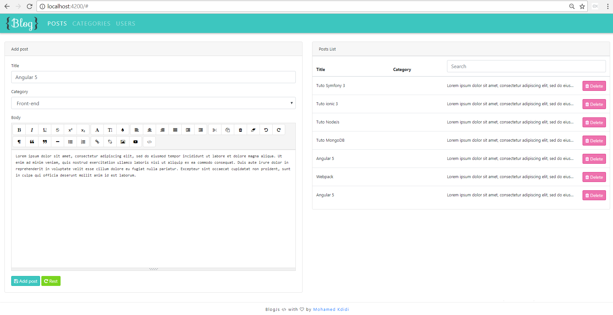

# Simple Blog with javaScript technology.

This application was built with Angular 5, Nodejs, Express, MongoDB and Bootstrap 4.1. 

# Requirements.

node and yarn

# Installation

Clone the repository

## Run the server side

Open server side folder 

```
cd server

```

Install the Express JS and MongoDB project dependency: 

```
yarn install

```

Run the project with node commande 

```
node app

```

## Run the client side

Open client side folder (Angular 5 projet) 

```
cd client

```

Install the Angular 5 project dependency: 

```
yarn install

```

Run the Angular 5 project with Angular CLI commande `ng serve`. Navigate to `http://localhost:4200/`. The app will automatically reload if you change any of the source files.




## Build

Run `ng build` to build the project. The build artifacts will be stored in the `dist/` directory. Use the `-prod` flag for a production build.

## Running unit tests

Run `ng test` to execute the unit tests via [Karma](https://karma-runner.github.io).

## Running end-to-end tests

Run `ng e2e` to execute the end-to-end tests via [Protractor](http://www.protractortest.org/).


## License

GNU v3 [Mohamed Kdidi](https://mohamedkdidi.github.io)


## Send Thanks
Bitcoin greatfully accepted: `37btVdM6R4yJFCaiKLS4HuXevR6K1ZX2tv`

